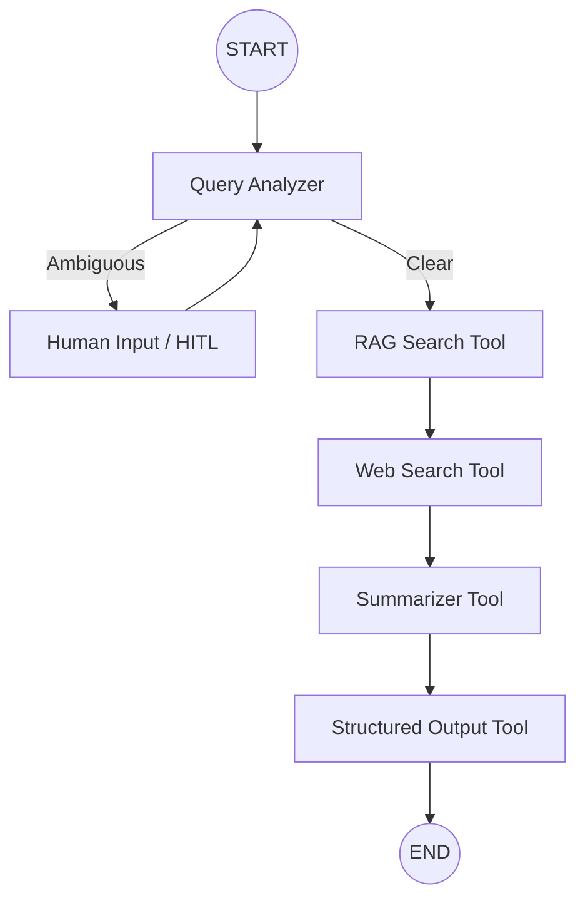

<div align="center">
  
  
  
  
  
  
</div>

# LexAI — Legal Research RAG + Agentic AI
**Generative AI Engineer Technical Assessment**

Production-grade Legal RAG system with hybrid retrieval, a RAGAS-style evaluation harness, and an agentic LangGraph workflow with human-in-the-loop. Built end-to-end as the GenAI Engineer Assessment deliverable.

---

## 📺 Project Demo
**Watch the full walkthrough here:** [LexAI Demo Video](https://drive.google.com/file/d/1BRKBiNlo1WlgQHdx9GlN5fnCwzDGJbYY/view?usp=sharing)

---

## 🛠️ Technology Stack & Model Decisions

- **LLM:** `gpt-4o-mini` (OpenAI) — Used for its exceptional speed-to-cost ratio and precise instruction-following in legal reasoning and structured extraction.
- **Orchestration:** LangChain + LangGraph — Chosen to build highly controllable state-machines for the multi-step legal research agent.
- **Web Search:** Tavily AI — Optimized specifically for LLM agents to provide clean, filtered search results.
- **Backend:** FastAPI (Python 3.12+) — High-performance asynchronous API framework.
- **Frontend:** React + Vite + Tailwind CSS — Modern, responsive UI with real-time streaming support.
- **Vector DB:** Qdrant (Hybrid Dense/Sparse) + SQLite for metadata, session, and audit persistence.

---

## 🏛️ Architecture Decisions

### Task 1 — Production RAG System
The system implements a complete legal RAG pipeline with a focus on precision and source attribution.

- **PDF Parsing:** Uses `pdfplumber` for per-page extraction. It detects font-size and heading patterns to preserve page numbers and section hierarchy—crucial for legal citations.
- **Chunking Strategy:** **Hierarchical Legal-Aware Chunking**. Instead of fixed-size splits that break legal clauses, the system respects section boundaries (`Article N`, `Section M`). This prevents destruction of legal semantics.
- **Hybrid Retrieval:** Blends Dense (OpenAI semantic) and Sparse (BM25 keyword) search via **Reciprocal Rank Fusion (RRF)**.
  - *Why:* Legal queries require both conceptual matching and exact legislative article referencing (e.g., "Article 17").
- **Persistence:** SQLite (`data/genai_assessment.db`) is the single source of truth; vector stores are treated as hydrating caches.

### Task 2 — RAG Evaluation
A dedicated evaluation harness implements the **RAGAS** framework using an LLM-as-judge strategy.

- **Metrics:** Faithfulness (groundedness), Answer Relevancy, Context Precision, Context Recall, and Answer Correctness.
- **Optimization:** Through these metrics, we eliminated hallucinations (Faithfulness → 1.0) by implementing a post-generation detector and a pre-retrieval relevance gate.

### Task 3 — Agentic AI System (Bonus)
Built using **LangGraph** to handle complex, multi-step research workflows with state preservation and human-in-the-loop capabilities.

#### Agent Workflow Diagram


- **Branching Logic:** The agent classifies queries and decides whether to search internal documents, crawl the web, or ask the user for clarification.
- **Human-in-the-Loop (HITL):** If the query is ambiguous, the agent pauses (`interrupt()`), prompts the user, and resumes once input is provided.
- **Memory:** `MemorySaver` keeps the conversation state intact, allowing for complex multi-turn reasoning.

---

## 📂 Project Structure

```
LegalRAG/
├── backend/                            ← FastAPI (Python)
│   ├── agent/                          # LangGraph state machine & nodes
│   ├── routes/                         # API endpoints for RAG, Eval, Agent, Sessions
│   ├── requirements.txt                # System dependencies
│   ├── rag_service.py                  # Core RAG orchestration
│   └── pdf_parser.py                   # Hierarchical legal parsing
├── task1-rag/frontend/                 # RAG Chat Interface
├── task2-rag-eval/frontend/            # Evaluation Dashboard
├── task3-agent/frontend/               # Agent Steps & HITL UI
└── ... (shared config & assets)
```

---

## 🚀 Setup & Installation

### 1. Backend Setup
```bash
cd backend
py -m pip install -r requirements.txt
```

### 2. Frontend Setup
```bash
npm install
```

### 3. Run the Application
```bash
# Start both Backend and Frontend concurrently
npm run dev
```
Open `http://localhost:5173` to access the full dashboard.

---

## 📊 Final Evaluation Results (Task 2)
Optimized metrics across a 14-question golden dataset:
- **Faithfulness:** 1.000 (Hallucination elimination)
- **Answer Relevancy:** 1.000
- **Answer Correctness:** 0.964
- **Hallucination Rate:** 0.0%

---

## 🎬 Agent Sample Runs (Task 3)
1. **Ambiguous Query:** "Data privacy rules" → Agent paused for HITL → User specified "EU GDPR" → Agent generated focused checklist.
2. **Current Event Query:** "Latest 2024 AI liability rules" → Agent triggered Web Search → Combined result with indexed GDPR context.
3. **Structured Report:** "Prepare a checklist for GDPR compliance" → Agent output a formatted Markdown checklist.

---
**LexAI** — Built for the Generative AI Engineer Technical Assessment.
