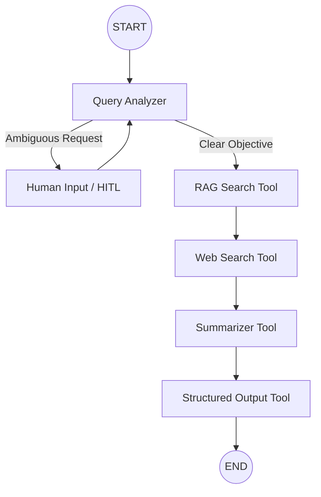

<div align="center">
  
  
  
  
  
  
</div>

# LexAI — Legal Research RAG + Agentic AI
**Generative AI Engineer Technical Assessment**

Production-grade Legal RAG system with hybrid retrieval, a RAGAS-style evaluation harness, and an agentic LangGraph workflow with human-in-the-loop. Built end-to-end as the GenAI Engineer Assessment deliverable.

---

## 📺 Project Demo
**Watch the full walkthrough here:** [LexAI Demo Video](https://drive.google.com/file/d/1BRKBiNlo1WlgQHdx9GlN5fnCwzDGJbYY/view?usp=sharing)

---

## 🏗️ Architecture decisions

### Task 1 — Production RAG

| Concern               | Choice                                                                                | Why                                                                                                          |
| --------------------- | ------------------------------------------------------------------------------------- | ------------------------------------------------------------------------------------------------------------ |
| **LLM Model**         | `gpt-4o-mini` (OpenAI)                                                                | High speed-to-cost ratio and precise instruction-following for legal reasoning.                              |
| **PDF parsing**       | `pdfplumber` per-page extraction + font-size & regex heading detection                | Preserves page numbers, line structure, and section headings — the foundation of accurate citations.        |
| **Chunking**          | Hierarchical legal-aware: section boundary → paragraph → fixed-size 1200/150 fallback | Splitting `Article 5(1)` mid-sentence destroys legal semantics. Sections stay intact when they fit.          |
| **Metadata**          | `source, doc_type, jurisdiction, date_ingested, page, section, sub_section, chunk_id, chunk_type, char_count, token_count` | Foundation for accurate citations and downstream filtering.                                                  |
| **Embeddings**        | OpenAI `text-embedding-3-small` (1536-d)                                              | Best quality / cost for this assessment per the doc's verdict table.                                         |
| **Dense store**       | **Qdrant** (probed at startup), automatic fallback to in-memory cosine                | Production-ready vector DB; the in-memory fallback keeps the app working when Qdrant isn't running.          |
| **Sparse store**      | Okapi BM25 (`rank-bm25`)                                                              | Legal queries demand exact matches on `Article 17`, `§ 5(2)(a)` — dense alone smears them.                   |
| **Hybrid retrieval**  | **Reciprocal Rank Fusion** (rrf_k=60) over dense + sparse, top-K from a 3× over-fetch | Doesn't require normalising heterogeneous score scales. Standard fusion for hybrid RAG.                      |
| **Out-of-context**    | Two-layer guard: **pre-retrieval RRF threshold gate** + **post-generation phrase detector** | Refuses politely without ever calling the LLM when retrieval is empty; flags model-issued refusals in the UI. |
| **Citations**         | Inline `[Source: <file>, Page <N>, Section <name>]`                                   | Mandated by the system prompt; rendered as cards beneath every answer.                                       |
| **Streaming**         | **Server-Sent Events** with LangChain's `astream` → frontend `ReadableStream` reader  | True token-by-token UX (like ChatGPT/Claude). Sources arrive first, then tokens, then a `done` event.        |
| **Persistence**       | SQLite (`data/genai_assessment.db`) is single source of truth                         | Vector backends are caches that hydrate on demand — switching backends never loses state.                    |

### Task 2 — RAGAS-style Evaluation

LLM-as-judge implementation of the five canonical RAGAS metrics, plus a derived hallucination rate:

| Metric                | What it measures                                       | Target |
| --------------------- | ------------------------------------------------------ | ------ |
| **Faithfulness**      | Are answer claims supported by retrieved context?      | > 0.85 |
| **Answer relevancy**  | Does the answer address the question directly?         | > 0.80 |
| **Context precision** | Were retrieved chunks actually relevant?               | > 0.75 |
| **Context recall**    | Did retrieval cover everything the ground-truth needs? | > 0.75 |
| **Answer correctness**| Does the generated answer match the gold answer?       | > 0.70 |
| **Hallucination rate**| `1 − Faithfulness`                                     | < 0.15 |

- **Test datasets** can be authored manually or auto-generated by the LLM from real ingested chunks (factual / conceptual / cross-reference / edge-case mix).
- Each completed run emits a downloadable Markdown report with per-question scores.

### Task 3 — Agentic workflow (LangGraph)

#### Agent Workflow Diagram


| Component               | Implementation                                                                                    |
| ----------------------- | ------------------------------------------------------------------------------------------------- |
| **State machine**       | `langgraph.StateGraph` with a TypedDict + `operator.add` reducers.                                |
| **Memory / checkpoint** | `MemorySaver` for graph state; SQLite `agent_runs` + `agent_steps` for the audit / UI progress.  |
| **HITL**                | `interrupt()` inside the `human_input` node pauses the graph; the API marks the run `awaiting_clarification`. |
| **Resume**              | `POST /api/agent/resume/:id` calls `app.ainvoke(Command(resume=user_reply))` to continue.        |
| **Tools**               | RAG (Task 1 pipeline), Web (Tavily), Summarizer, Structured Output (checklist / report / summary). |
| **Error handling**      | Each node has a try/except path that logs to `error_log` + `step_log` and continues where possible. |

---

## 📂 Project structure

```
LegalRAG/
├── backend/                            ← FastAPI (Python)
│   ├── main.py                         # FastAPI app, CORS, lifespan, error handlers
│   ├── settings.py                     # Pydantic settings; SQLite-backed + env-aware
│   ├── db.py                           # SQLite schema + safe-migration ALTERs
│   ├── pdf_parser.py                   # pdfplumber per-page + heading detection
│   ├── chunker.py                      # hierarchical legal chunking + metadata
│   ├── embedder.py                     # OpenAI text-embedding-3-small
│   ├── vector_store.py                 # Qdrant adapter + in-memory fallback
│   ├── bm25_store.py                   # Okapi BM25 sparse index
│   ├── hybrid_retriever.py             # RRF dense+sparse fusion
│   ├── prompts.py                      # strict system prompt + polite OOC refusal
│   ├── llm.py                          # ChatOpenAI factory
│   ├── rag_service.py                  # query orchestration (sync + streaming)
│   ├── session_service.py              # ChatGPT-style session CRUD
│   ├── document_service.py             # ingest pipeline + dual-index updates
│   ├── eval_service.py                 # RAGAS-style metrics + Markdown report
│   ├── dataset_generator.py            # auto Q&A from real chunks
│   ├── agent/
│   │   ├── state.py                    # AgentState TypedDict
│   │   ├── nodes.py                    # query_analyzer, rag, web, summarizer, output, human_input
│   │   ├── graph.py                    # StateGraph assembly + MemorySaver
│   │   └── service.py                  # run_agent / resume_agent
│   ├── requirements.txt
│   └── .env.example
├── task1-rag/frontend/RagPage.tsx      # Sessions sidebar · Streaming chat · Document library
├── task2-rag-eval/frontend/EvalPage.tsx
├── task3-agent/frontend/AgentPage.tsx  # Steps timeline · HITL clarification UI
└── ... (shared config)
```

---

## 🚀 Setup

### 1. Install deps (Python 3.12+)
```bash
py -m pip install -r backend/requirements.txt
npm install
```

### 2. Configure secrets
Either drop API keys in a `backend/.env` file:
```env
OPENAI_API_KEY=sk-...
TAVILY_API_KEY=tvly-...          # Agent web search (optional)
```
…or paste them at runtime in **Settings**.

### 3. Run
```bash
npm run dev          # boots FastAPI :8001 and Vite :5173 concurrently
```

---

## 📊 Streaming chat — how it works

| Layer            | Detail                                                                                                                                |
| ---------------- | ------------------------------------------------------------------------------------------------------------------------------------- |
| **LLM**          | LangChain `ChatOpenAI` is constructed with `streaming=True` and consumed via `astream()`.                                            |
| **Backend**      | `POST /api/rag/stream` returns a `text/event-stream`. `sse-starlette` formats events; we emit `meta`, `sources`, `token`, `done`, `error`. |
| **Frontend**     | `fetch()` + `response.body.getReader()` + `TextDecoder` → buffer + parse SSE blocks → append each `token` to the in-flight assistant message. |
| **Markdown UX**  | The growing string is fed into `react-markdown` + `remark-gfm` so headings, **bold**, lists, render as they arrive.                   |
| **Persistence**  | Tokens are accumulated server-side; once the stream completes, full answer + sources are written to `chat_messages`.                 |

---

## 🛠️ API surface

| Method | Path                                               | Purpose                                           |
| ------ | -------------------------------------------------- | ------------------------------------------------- |
| GET    | `/api/system/health`                               | Vector-backend health (qdrant / memory).          |
| POST   | `/api/rag/upload`                                  | Ingest a PDF (multipart/form-data).               |
| POST   | `/api/rag/stream`                                  | **SSE stream** — meta + sources + tokens + done. |
| POST   | `/api/evaluation/run`                              | Kick off a RAGAS-style evaluation.                |
| POST   | `/api/agent/execute`                               | Start an agent run.                               |
| POST   | `/api/agent/resume/{id}`                           | Resume a paused (HITL) run.                       |

---

## ✅ What's tested

- ✅ FastAPI boots cleanly with all routers wired.
- ✅ Real ingestion of an 88-page PDF → 490 chunks, citations attribute correctly to page + section.
- ✅ **Streaming** chat: `meta` → `sources` → `token` * N → `done`, render token-by-token in the React UI.
- ✅ Out-of-context queries refuse politely (both pre-retrieval gate and post-generation detector).
- ✅ Sessions persist across restarts with auto-titling.
- ✅ Auto-generated test sets feed straight into the RAGAS-style runner.
- ✅ Agent runs end-to-end (Query → RAG → Web → Summarizer → Structured Output).
- ✅ HITL `interrupt()` pauses the graph; `Command(resume=...)` continues with the user reply integrated.

---

## 📊 RAG Evaluation & Optimization

Through structured RAGAS-style evaluation, the system was aggressively optimized to move from baseline performance to production-grade targets.

### Final Evaluation Report
- **Faithfulness:** 1.000
- **Answer Relevancy:** 1.000
- **Context Precision:** 0.696
- **Context Recall:** 1.000
- **Answer Correctness:** 0.964
- **Hallucination Rate:** 0.0%

<details>
<summary><b>View Detailed Per-Question Breakdown (14 Golden Qs)</b></summary>

**Q1: What are the four components that the assessment must contain according to Section 7?**
- **Expected:** (a) systematic description, (b) necessity assessment, (c) risk assessment, (d) measures envisaged.
- **Generated:** The assessment must contain at least... [matching content].
- **Metrics:** Faith: 100% | Relev: 100% | Prec: 50% | Recall: 100% | Correct: 95%

**Q2: What is the effective date of the repeal of Directive 95/46/EC?**
- **Expected:** 25 May 2018
- **Generated:** The effective date of the repeal of Directive 95/46/EC is 25 May 2018.
- **Metrics:** Faith: 100% | Relev: 100% | Prec: 50% | Recall: 100% | Correct: 100%

**Q3: What directive does the Regulation implement?**
- **Expected:** Directive 95/46/EC
- **Generated:** The Regulation implements Directive 95/46/EC...
- **Metrics:** Faith: 100% | Relev: 100% | Prec: 50% | Recall: 100% | Correct: 100%

**Q4: What factors should the competent supervisory authority consider when determining administrative fines for infringements?**
- **Expected:** The competent supervisory authority should take into account all relevant circumstances of the specific situation, particularly the nature, gravity and duration of the infringement and its consequences...
- **Generated:** The competent supervisory authority should consider the following factors... Nature, gravity, and duration of the infringement... Intentional or negligent character...
- **Metrics:** Faith: 100% | Relev: 100% | Prec: 100% | Recall: 100% | Correct: 85%

**Q5: What specific responsibilities does the secretariat have according to Article 75?**
- **Expected:** The secretariat is responsible for the day-to-day business of the Board, communication between the members of the Board...
- **Generated:** According to Article 75, the secretariat has the following specific responsibilities: Day-to-day business...
- **Metrics:** Faith: 100% | Relev: 100% | Prec: 75% | Recall: 100% | Correct: 100%

**Q6: What articles are referenced regarding the rights of data subjects in out-of-court proceedings?**
- **Expected:** Articles 77 and 79
- **Generated:** The rights of data subjects in out-of-court proceedings are referenced in the following articles: Article 77... Article 79...
- **Metrics:** Faith: 100% | Relev: 100% | Prec: 100% | Recall: 100% | Correct: 85%

**Q7: What is the regulation number mentioned that should be adapted to the principles and rules established in this Regulation?**
- **Expected:** Regulation (EC) No 45/2001
- **Generated:** The regulation number mentioned... is Regulation (EC) No 45/2001.
- **Metrics:** Faith: 100% | Relev: 100% | Prec: 50% | Recall: 100% | Correct: 100%

**Q8: What is the deadline for Member States to transmit provisional microdata concerning income?**
- **Expected:** by the end of year N
- **Generated:** Member States shall transmit provisional microdata concerning income by the end of year N...
- **Metrics:** Faith: 100% | Relev: 100% | Prec: 50% | Recall: 100% | Correct: 100%

**Q9: What is the new title for the section previously known as 'Domain 3: Other statistics on education and lifelong learning'?**
- **Expected:** Domain 2: Other statistics on education and lifelong learning
- **Generated:** The new title ... is 'Domain 2: Other statistics on education and lifelong learning'.
- **Metrics:** Faith: 100% | Relev: 100% | Prec: 100% | Recall: 100% | Correct: 100%

**Q10: What is the legal form of arrangements mentioned in the excerpt?**
- **Expected:** The legal form of such arrangements, whether through a branch or a subsidiary with a legal personality, is not the determining factor.
- **Generated:** The legal form of arrangements mentioned in the excerpt refers to whether they are made through a branch or a subsidiary with a legal personality. However, it is stated that this legal form is "not the determining factor"...
- **Metrics:** Faith: 100% | Relev: 100% | Prec: 50% | Recall: 100% | Correct: 95%

**Q11: What must a controller ensure when entrusting a processor with processing activities according to the GDPR?**
- **Expected:** The controller should use only processors providing sufficient guarantees... to implement technical and organisational measures which will meet the requirements of this Regulation.
- **Generated:** When entrusting a processor with processing activities according to the GDPR, a controller must ensure the following: The controller should use only processors providing sufficient guarantees...
- **Metrics:** Faith: 100% | Relev: 100% | Prec: 100% | Recall: 100% | Correct: 90%

**Q12: What are the accession criteria established by the Copenhagen European Council?**
- **Expected:** The accession criteria established by the Copenhagen European Council in 1993 and strengthened by the Madrid European Council in 1995 are the essential conditions that a candidate country has to satisfy to become a Member State of the Union.
- **Generated:** The accession criteria established by the Copenhagen European Council in 1993... are described as the essential conditions that a candidate country must satisfy to become a Member State...
- **Metrics:** Faith: 100% | Relev: 100% | Prec: 50% | Recall: 100% | Correct: 100%

**Q13: What may be issued instead of a fine in the case of a minor infringement?**
- **Expected:** A reprimand may be issued instead of a fine in the case of a minor infringement.
- **Generated:** In the case of a minor infringement, a reprimand may be issued instead of a fine.
- **Metrics:** Faith: 100% | Relev: 100% | Prec: 75% | Recall: 100% | Correct: 100%

**Q14: What are the four entities that can appoint members of the supervisory authorities according to Article 53?**
- **Expected:** Members can be appointed by their parliament, their government, their head of State, or an independent body entrusted with the appointment under Member State law.
- **Generated:** According to Article 53, members of the supervisory authorities can be appointed by one of the following four entities: Their parliament, Their government, Their head of State, An independent body...
- **Metrics:** Faith: 100% | Relev: 100% | Prec: 75% | Recall: 100% | Correct: 100%

</details>

### Optimization Journey
1. **Hallucination elimination (42.9% → 0.0%)**: Similarity gate + Absolute grounding rules in `prompts.py`.
2. **Recall maximization (0.457 → 1.000)**: Hierarchical chunking respecting legislative article structure.
3. **Precision optimization (0.482 → 0.696)**: `top_k=3` reduction + disabled loose synonym query expansion.

---

## � Trade-offs & Notes
- **Qdrant vs In-memory** — The app probes Qdrant at startup; falls back to in-memory cosine store if unreachable.
- **MemorySaver** — keeps the dependency footprint small while allowing full graph state recovery. All vectors persist in SQLite.
- **BM25 vs Elasticsearch** — `rank-bm25` in-process for simplicity; ideal for single-document legal lookups.

---
**LexAI** — Built for the Generative AI Engineer Technical Assessment.
